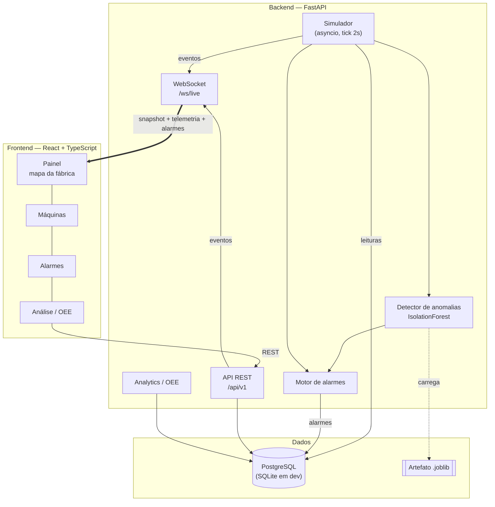
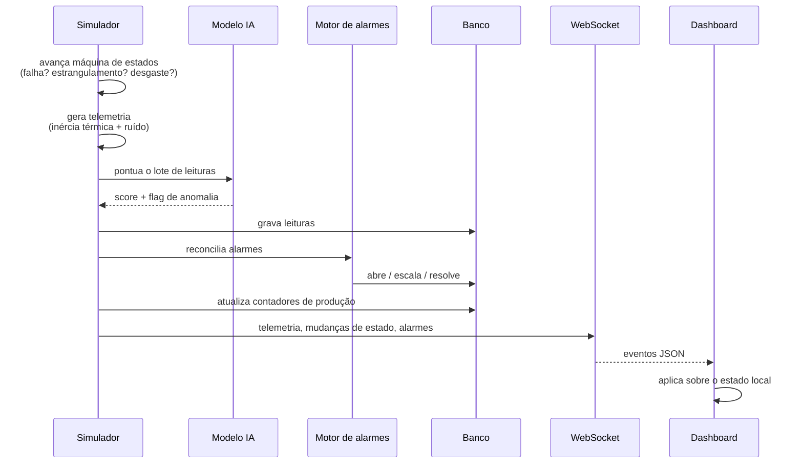
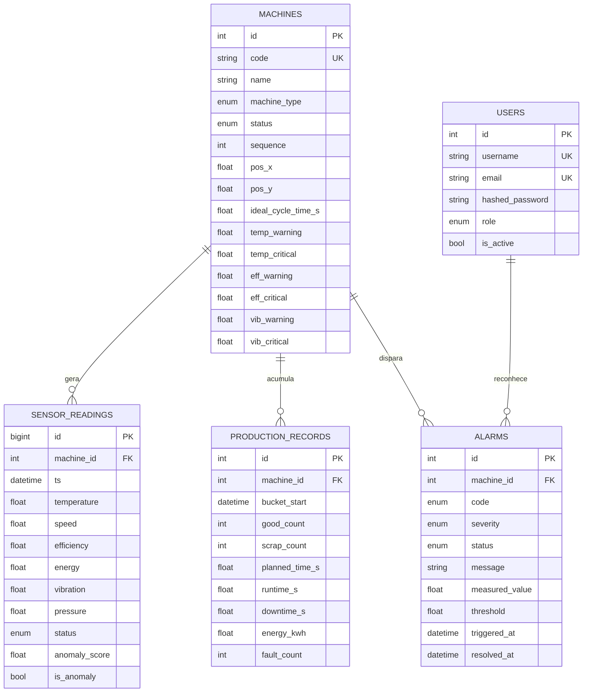

# FactoryTwin — Digital Twin para Monitoramento Inteligente de Linhas de Produção

Plataforma de **Digital Twin** que simula, monitora e analisa uma linha de produção
industrial em tempo real: telemetria de sensores, cálculo de OEE, motor de alarmes
com histerese, detecção de anomalias por IA e um painel que se atualiza sozinho via
WebSocket.

```
Simulador  ──▶  FastAPI  ──▶  PostgreSQL
    │              │
    │              ├──▶  Motor de alarmes  ──┐
    │              ├──▶  IsolationForest  ───┤
    │              │                         ▼
    └──────────────┴──────────▶  WebSocket ──▶  Dashboard React
```

---

## Índice

- [O que a plataforma faz](#o-que-a-plataforma-faz)
- [Arquitetura](#arquitetura)
- [Stack](#stack)
- [Como rodar](#como-rodar)
- [Usuários e perfis](#usuários-e-perfis)
- [A linha simulada](#a-linha-simulada)
- [Documentação da API](#documentação-da-api)
- [Modelo de dados](#modelo-de-dados)
- [Decisões de projeto](#decisões-de-projeto)
- [Testes](#testes)
- [Estrutura do repositório](#estrutura-do-repositório)
- [Roadmap por fase](#roadmap-por-fase)
- [Solução de problemas](#solução-de-problemas)

---

## O que a plataforma faz

| Capacidade | Descrição |
|------------|-----------|
| **Gêmeo digital** | 8 máquinas com máquina de estados própria, inércia térmica, desgaste acumulado e estrangulamento a jusante |
| **Telemetria** | Temperatura, velocidade, eficiência, energia, vibração e pressão, amostradas a cada 2 s |
| **KPIs** | OEE decomposto (Disponibilidade × Performance × Qualidade), refugo, MTBF, MTTR e energia por peça |
| **Alarmes** | 8 regras com deduplicação, escalonamento de severidade e histerese |
| **IA** | `IsolationForest` sobre features normalizadas pelo nominal de cada máquina |
| **Tempo real** | Um único WebSocket alimenta todo o painel — sem polling |
| **Segurança** | JWT com três perfis hierárquicos |

---

## Arquitetura



### Fluxo de um tick do simulador



O trabalho de banco roda em `asyncio.to_thread`, então o laço do simulador nunca
bloqueia o event loop que serve a API.

---

## Stack

| Camada | Tecnologias |
|--------|-------------|
| Backend | Python 3.11, FastAPI, SQLAlchemy 2.0, Pydantic v2, Uvicorn |
| Banco | PostgreSQL 16 (produção) · SQLite (desenvolvimento) |
| IA | Scikit-learn, Pandas, NumPy, Joblib |
| Frontend | React 18, TypeScript, Vite, React Router, Recharts |
| Infra | Docker, Docker Compose, Nginx |
| Qualidade | Pytest, Ruff, `tsc --noEmit` |

---

## Como rodar

### Opção 1 — Docker Compose

```bash
cp .env.example .env
```

```bash
docker compose up --build
```

| Serviço | URL |
|---------|-----|
| Dashboard | http://localhost:3000 |
| API (Swagger) | http://localhost:8000/docs |
| ReDoc | http://localhost:8000/redoc |
| Health check | http://localhost:8000/health |

O banco é criado e populado automaticamente no primeiro boot, e o simulador começa
a rodar sozinho.

> **Nota:** os arquivos Docker deste repositório ainda **não foram executados** em
> uma máquina com Docker instalado. O fluxo local abaixo está validado ponta a ponta.

### Opção 2 — Local (validado)

**Backend** — crie o virtualenv **fora da pasta do projeto** (ver
[Solução de problemas](#solução-de-problemas)):

```bash
python -m venv ~/.venvs/factorytwin
```

```bash
~/.venvs/factorytwin/bin/pip install -r backend/requirements-dev.txt
```

No Windows (PowerShell):

```powershell
python -m venv "$env:USERPROFILE\.venvs\factorytwin"; & "$env:USERPROFILE\.venvs\factorytwin\Scripts\pip.exe" install -r backend\requirements-dev.txt
```

Suba a API a partir de `backend/`:

```bash
uvicorn app.main:app --reload --port 8000
```

**Frontend**, em outro terminal:

```bash
npm install --prefix frontend
```

```bash
npm run dev --prefix frontend
```

O Vite faz proxy de `/api` e `/ws` para `localhost:8000`, então não há CORS nem
variável de ambiente a configurar. Abra http://localhost:5173.

### Treinar o modelo de anomalias

A plataforma roda normalmente sem o modelo (a detecção fica apenas desativada).
Para treiná-lo, de dentro de `backend/`:

```bash
python -m app.ml.train --synthetic
```

Depois que o simulador tiver acumulado histórico, treine com dados reais:

```bash
python -m app.ml.train
```

Também é possível retreinar pela interface, em **Análise → Modelo de anomalias →
Retreinar** (requer perfil `ADMIN`).

---

## Usuários e perfis

Criados automaticamente no primeiro boot:

| Usuário | Senha | Perfil | Pode |
|---------|-------|--------|------|
| `admin` | `admin123` | Administrador | Tudo: CRUD de máquinas e usuários, treinar o modelo, controlar o simulador |
| `operador` | `operador123` | Operador | Reconhecer/resolver alarmes, comandar estados, ingerir leituras |
| `visitante` | `visitante123` | Visitante | Somente leitura |

A hierarquia é `VIEWER < OPERATOR < ADMIN` — um administrador atende a qualquer
exigência de perfil.

> Troque `SECRET_KEY` e `FIRST_ADMIN_PASSWORD` em qualquer ambiente que não seja o
> seu próprio computador.

---

## A linha simulada

`LINE-01 — Montagem e Acabamento`, oito estações em série:

| # | Código | Máquina | Métrica dominante |
|---|--------|---------|-------------------|
| 1 | `INJ-01` | Injetora | Temperatura (195 °C) |
| 2 | `CNV-01` | Esteira transportadora | Velocidade |
| 3 | `ROB-01` | Braço robótico | Vibração |
| 4 | `PNT-01` | Cabine de pintura | Pressão |
| 5 | `OVN-01` | Forno de cura | Temperatura (165 °C) |
| 6 | `INS-01` | Inspeção visual | Qualidade |
| 7 | `PKG-01` | Empacotadora | Velocidade |
| 8 | `PAL-01` | Paletizadora | Energia |

Estados possíveis: `RUNNING`, `IDLE`, `SETUP`, `MAINTENANCE`, `FAULT`, `OFFLINE`.

**Efeito cascata:** como as estações são sequenciais, uma parada a montante
estrangula tudo o que vem depois. Isso aparece no OEE — numa corrida de 300 ticks:

```
INJ-01   OEE = 88.0%   (primeira estação, nunca fica sem material)
CNV-01   OEE = 87.3%
ROB-01   OEE = 85.8%
PNT-01   OEE = 72.0%
OVN-01   OEE = 67.5%
INS-01   OEE = 66.5%
PKG-01   OEE = 61.5%
PAL-01   OEE = 56.7%   ← gargalo
```

Detalhes completos do domínio: [`docs/01-planejamento.md`](docs/01-planejamento.md).

---

## Documentação da API

Swagger interativo em **http://localhost:8000/docs** (use o botão *Authorize* com
`admin` / `admin123`).

### Principais endpoints

| Método | Rota | Perfil | Descrição |
|--------|------|--------|-----------|
| `POST` | `/api/v1/auth/login/json` | — | Autentica e devolve o JWT |
| `GET` | `/api/v1/auth/me` | VIEWER | Usuário autenticado |
| `GET` | `/api/v1/machines` | VIEWER | Lista máquinas (paginado) |
| `GET` | `/api/v1/machines/live` | VIEWER | Máquinas + telemetria + alarmes (mapa) |
| `POST` | `/api/v1/machines` | ADMIN | Cadastra máquina |
| `PATCH` | `/api/v1/machines/{id}` | ADMIN | Atualiza limites de processo |
| `POST` | `/api/v1/machines/{id}/status` | OPERATOR | Comanda o estado |
| `GET` | `/api/v1/readings/machines/{id}/series` | VIEWER | Série temporal de uma métrica |
| `POST` | `/api/v1/readings` | OPERATOR | Ingere telemetria externa (CLP/IoT) |
| `GET` | `/api/v1/production/summary` | VIEWER | Resumo consolidado da linha |
| `GET` | `/api/v1/production/oee` | VIEWER | OEE da linha ou de uma máquina |
| `GET` | `/api/v1/production/oee/ranking` | VIEWER | OEE por máquina (gargalo primeiro) |
| `GET` | `/api/v1/alarms` | VIEWER | Alarmes abertos |
| `POST` | `/api/v1/alarms/{id}/acknowledge` | OPERATOR | Reconhece |
| `POST` | `/api/v1/alarms/{id}/resolve` | OPERATOR | Resolve |
| `GET` | `/api/v1/ml/model` | VIEWER | Status do modelo |
| `POST` | `/api/v1/ml/model/train` | ADMIN | Retreina |
| `GET` | `/api/v1/simulation/state` | VIEWER | Estado do simulador |
| `POST` | `/api/v1/simulation/machines/{id}/inject-fault` | OPERATOR | Injeta falha (demo) |
| `WS` | `/ws/live?token=<JWT>` | VIEWER | Canal de tempo real |

### Exemplo

```bash
curl -s -X POST http://localhost:8000/api/v1/auth/login/json -H "Content-Type: application/json" -d '{"username":"admin","password":"admin123"}'
```

### Eventos do WebSocket

Todo evento segue o mesmo envelope:

```json
{ "type": "telemetry", "ts": "2026-07-31T22:04:51Z", "payload": [] }
```

| `type` | Quando | Payload |
|--------|--------|---------|
| `snapshot` | Ao conectar | Máquinas, alarmes abertos e resumo da linha |
| `telemetry` | A cada tick | Lista de leituras |
| `machine_status` | Transição de estado | `{machine_id, from, to}` |
| `alarm_raised` | Alarme aberto ou escalado | Alarme completo |
| `alarm_updated` | Reconhecimento | Alarme completo |
| `alarm_resolved` | Condição normalizada | Alarme completo |
| `line_summary` | A cada 5 ticks | KPIs agregados |
| `simulator_state` | Start/stop | `{running}` |

O navegador não permite cabeçalhos em WebSocket, por isso o JWT vai na query
string.

---

## Modelo de dados



### Como o OEE é calculado

```
OEE = Disponibilidade × Performance × Qualidade

Disponibilidade = runtime_s / planned_time_s
Performance     = (peças_totais × tempo_ciclo_ideal) / runtime_s
Qualidade       = good_count / peças_totais
```

Os tempos ficam agregados por hora em `production_records`, então o cálculo é uma
soma — não exige varrer a série temporal inteira.

---

## Decisões de projeto

**Limites de alarme ficam na tabela `machines`, não no código.** O motor de regras
é genérico; cadastrar um equipamento novo com limites próprios não exige mudar
Python. A validação impede limites incoerentes (aviso acima do crítico).

**Histerese nos alarmes.** Um alarme só é resolvido quando a grandeza volta com 5%
de folga além do gatilho. Sem isso, uma temperatura oscilando em torno do limite
geraria dezenas de alarmes por minuto.

**Escalonamento reabre o alarme.** Um `WARNING` já reconhecido que vira `CRITICAL`
volta para `ACTIVE` — a situação piorou e precisa de nova atenção do operador.

**Features de IA normalizadas pelo nominal de cada máquina.** O modelo recebe
`temperatura / temp_nominal`, não a temperatura absoluta. É isso que permite um
único `IsolationForest` servir à injetora (195 °C) e à esteira (38 °C).

**Degradação elegante do ML.** Sem o artefato `.joblib`, o detector fica inativo e
registra um aviso — a plataforma inteira continua funcionando.

**SQLite em desenvolvimento, PostgreSQL em produção.** Os enums usam
`native_enum=False` (VARCHAR + CHECK) e o `BigInteger` da série temporal cai para
`Integer` no SQLite, que é o único tipo com AUTOINCREMENT nesse dialeto.

**`PRAGMA foreign_keys=ON` no SQLite.** Sem isso o `ON DELETE CASCADE` é ignorado
silenciosamente e, como o SQLite reaproveita o rowid da última linha removida,
registros órfãos acabariam colados à próxima máquina cadastrada.

**Um WebSocket para tudo.** O painel recebe um `snapshot` completo ao conectar e
depois só deltas. Não há polling em lugar nenhum do dashboard.

---

## Testes

De dentro de `backend/`:

```bash
pytest
```

```bash
ruff check .
```

No frontend:

```bash
npm run lint --prefix frontend
```

**84 testes**, cobrindo:

| Arquivo | Foco |
|---------|------|
| `test_auth.py` | Login, hierarquia de perfis, proteção de rotas, gestão de usuários |
| `test_machines.py` | CRUD, validação de limites, paginação, comando de estado |
| `test_alarm_engine.py` | As 8 regras, deduplicação, escalonamento, histerese |
| `test_alarms_api.py` | Ingestão que dispara alarme, reconhecimento, resolução |
| `test_simulator.py` | Determinismo, limites físicos, ciclo de falha, contabilidade |
| `test_analytics.py` | Fórmula de OEE, divisão por zero, agregações |
| `test_realtime.py` | Envelope de evento, snapshot, autenticação do WebSocket |
| `test_ml.py` | Features, treino, inferência, degradação sem modelo |

---

## Estrutura do repositório

```
.
├── backend/
│   ├── app/
│   │   ├── api/v1/endpoints/   auth, machines, readings, production,
│   │   │                       alarms, ml, simulation, websocket
│   │   ├── core/               configuração e segurança (JWT, hash)
│   │   ├── crud/               camada de acesso a dados
│   │   ├── db/                 engine, sessão, schema e seed
│   │   ├── ml/                 treino do IsolationForest
│   │   ├── models/             ORM: Machine, SensorReading,
│   │   │                       ProductionRecord, Alarm, User
│   │   ├── schemas/            contratos Pydantic
│   │   ├── services/           simulador, alarmes, analytics,
│   │   │                       anomalias, realtime
│   │   └── main.py
│   ├── tests/
│   ├── Dockerfile
│   └── requirements.txt
├── frontend/
│   ├── src/
│   │   ├── api/                cliente HTTP + URL do WebSocket
│   │   ├── auth/               contexto de sessão
│   │   ├── components/         FactoryMap, MetricChart, AlarmList
│   │   ├── hooks/              useRealtime, useMetricHistory
│   │   ├── pages/              Dashboard, Machines, Alarms, Analytics
│   │   └── types.ts
│   ├── Dockerfile
│   └── nginx.conf
├── docs/
│   ├── 01-planejamento.md      domínio industrial
│   └── 02-arquitetura.md       decisões técnicas
├── docker-compose.yml
└── .env.example
```

---

## Roadmap por fase

| Fase | Entrega | Situação |
|------|---------|----------|
| 1 | Planejamento do domínio industrial | ✅ |
| 2 | Modelagem do banco (PostgreSQL + SQLAlchemy) | ✅ |
| 3 | API REST com CRUD e Swagger | ✅ |
| 4 | Simulador com eventos de falha | ✅ |
| 5 | Dashboard React com indicadores, gráficos e mapa | ✅ |
| 6 | Tempo real via WebSockets | ✅ |
| 7 | Motor de alarmes | ✅ |
| 8 | IA de detecção de anomalias | ✅ |
| 9 | Autenticação e perfis | ✅ |
| 10 | Docker Compose e documentação | ⚠️ escrito, execução não verificada |

---

## Solução de problemas

**`ensurepip` falha ao criar o virtualenv / `WinError 206`**
O caminho desta pasta tem mais de 100 caracteres e alguns arquivos do `setuptools`
estouram o limite `MAX_PATH` do Windows. Crie o virtualenv fora do projeto:

```powershell
python -m venv "$env:USERPROFILE\.venvs\factorytwin"
```

**`ModuleNotFoundError: No module named 'app'`**
Rode os comandos de dentro de `backend/`, ou defina `PYTHONPATH` para essa pasta.

**O dashboard fica em "Desconectado"**
O backend precisa estar no ar em `localhost:8000`. O hook reconecta sozinho com
backoff exponencial (1 s → 15 s), então basta subir a API.

**Nenhuma anomalia é detectada**
O modelo ainda não foi treinado. Rode `python -m app.ml.train --synthetic` de
dentro de `backend/`, ou use **Análise → Retreinar** como `admin`.

**O e-mail `@factorytwin.local` é recusado**
`.local` é um TLD de uso especial e o validador do Pydantic o rejeita. O projeto
usa `@factorytwin.io` nos usuários de demonstração.

---

## Licença

Projeto de portfólio, disponibilizado para fins educacionais.
